# SCP Foundation Database - User Manual

Welcome to the SCP Foundation Database Management System. This manual will guide you through using the web interface to browse, search, and manage SCP Foundation records.

---

## Table of Contents

1. [Introduction](#introduction)
2. [Getting Started](#getting-started)
3. [Navigation Overview](#navigation-overview)
4. [Browsing SCP Entries](#browsing-scp-entries)
5. [Advanced Search](#advanced-search)
6. [Personnel Directory](#personnel-directory)
7. [MTF Registry](#mtf-registry)
8. [Facilities Directory](#facilities-directory)
9. [Incident Reports](#incident-reports)
10. [Understanding Object Classes](#understanding-object-classes)
11. [Security Clearance Levels](#security-clearance-levels)
12. [Glossary](#glossary)

---

## Introduction

### What is this System?

The SCP Foundation Database is a comprehensive management system for tracking and organizing information about:

- **SCPs** - Anomalous objects, entities, and phenomena under Foundation containment
- **Personnel** - Foundation staff including researchers, agents, and security officers
- **Mobile Task Forces (MTFs)** - Specialized units deployed for field operations
- **Facilities** - Sites and Areas where SCPs are contained and research is conducted
- **Incidents** - Security breaches, containment failures, and other notable events

### Who is this Manual For?

This manual is designed for Foundation personnel who need to:
- Look up information about contained anomalies
- Search for specific SCP entries
- Review incident reports
- Manage personnel and facility records

No technical database knowledge is required to use this system.

---

## Getting Started

### Accessing the System

1. Open your web browser (Chrome, Firefox, Safari, or Edge recommended)
2. Navigate to: `http://localhost:5000/frontend/`
3. You will see the Foundation homepage

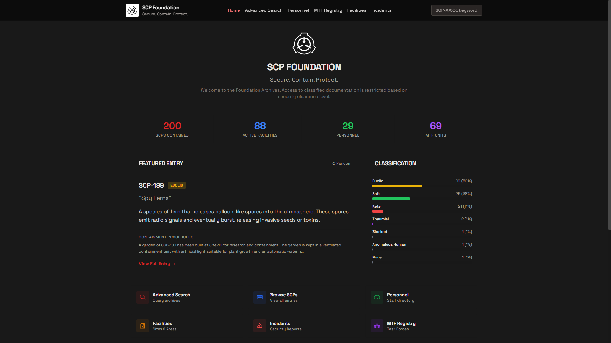

### System Requirements

- Modern web browser with JavaScript enabled
- Screen resolution of 1280x720 or higher recommended
- Stable internet/network connection to the database server

---

## Navigation Overview

The main navigation bar appears at the top of every page:

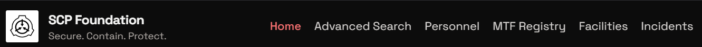

| Menu Item | Description |
|-----------|-------------|
| **Home** | Return to the main dashboard |
| **Advanced Search** | Search SCPs with multiple filters |
| **Personnel** | View and manage Foundation staff |
| **MTF Registry** | Browse Mobile Task Force units |
| **Facilities** | View Sites and Areas |
| **Incidents** | Review incident reports |

## Browsing SCP Entries

### The SCP Database

From the homepage, you can browse to contained anomalies. SCPs are displayed as cards showing:

- **SCP Code** (e.g., SCP-173)
- **Object Class** (Safe, Euclid, Keter, etc.)
- **Title/Nickname**
- **Brief description**

## Advanced Search

The Advanced Search page allows you to find SCPs using multiple criteria.

### How to Search

1. Click **Advanced Search** in the navigation menu
2. Enter your search criteria:
   - **Keyword** - Search in titles and descriptions
   - **Object Class** - Filter by Safe, Euclid, Keter, etc.
   - **Clearance Level** - Filter by required security clearance
3. Click **Search** or press Enter
4. Results will display below the search form

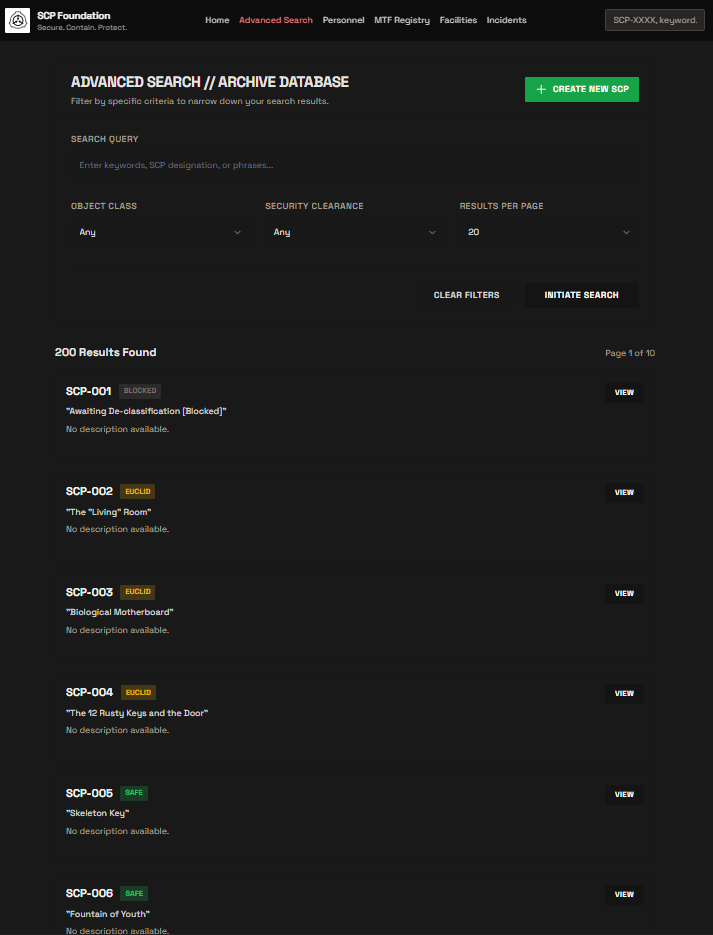

---

### Viewing an SCP Entry

Click on any SCP card to view its full dossier, which includes:

1. **Basic Information**
   - SCP Code and Title
   - Object Class
   - Security Clearance Required

2. **Containment Procedures**
   - Special requirements for safe containment
   - Housing specifications
   - Interaction protocols

3. **Description**
   - Full description of the anomaly
   - Known properties and behaviors
   - Historical information

4. **Related Information**
   - Incident history
   - Assigned personnel
   - Current containment location

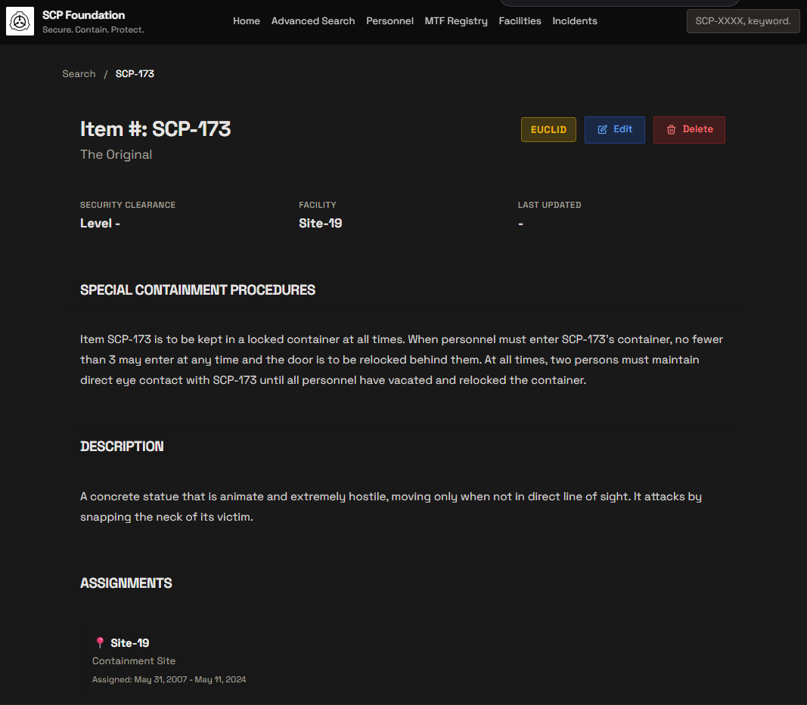

---

## Personnel Directory

### Viewing Personnel

The Personnel page displays all Foundation staff members.

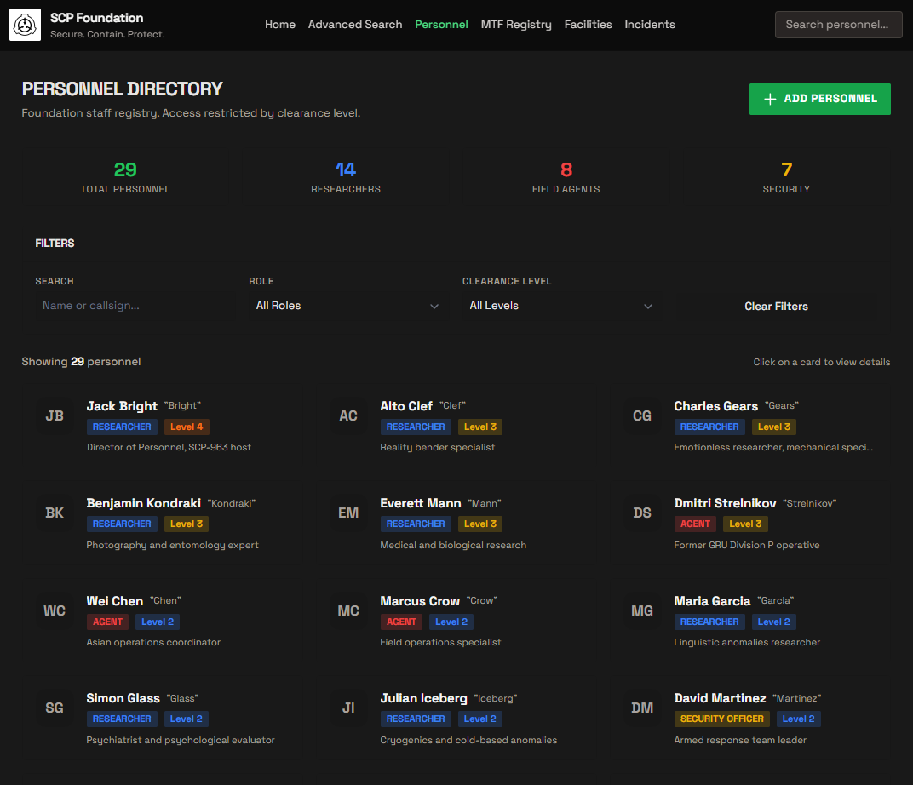

Each personnel card shows:
- **Name/Callsign**
- **Role** (Researcher, Agent, Security Officer)
- **Security Clearance Level**
- **Current Assignment**

### Personnel Details

Click on a personnel card to view their full profile:

- Personal information
- Clearance level and access permissions
- Assignment history
- Related incidents

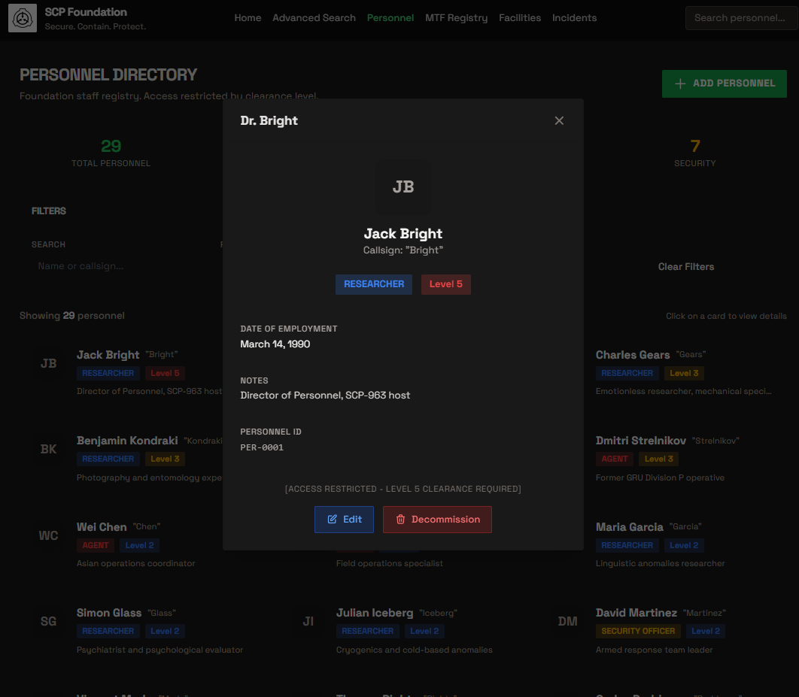

### Adding New Personnel

1. Click the **+ Add Personnel** button
2. Fill in the required fields:
   - Given Name
   - Surname
   - Callsign (optional)
   - Role
   - Security Clearance
3. Click **Save**

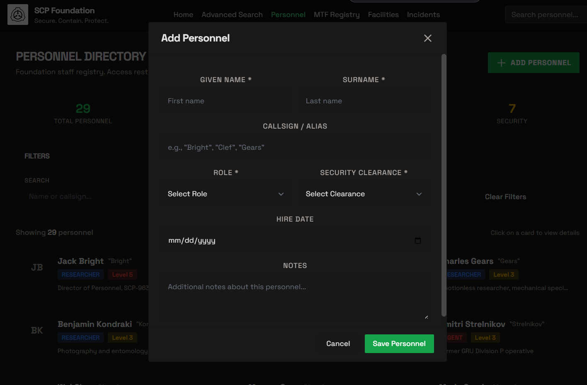

### Editing Personnel

1. Click on a personnel card to open details
2. Click **Edit** button
3. Modify the desired fields
4. Click **Save** to confirm changes

### Decommissioning Personnel

1. Open the personnel detail view
2. Click **Decommission**
3. Confirm the action in the dialog

> **Warning:** Decommissioning removes the personnel record permanently. This action cannot be undone.

---

## MTF Registry

### What are Mobile Task Forces?

Mobile Task Forces (MTFs) are specialized units composed of personnel from across the Foundation. They are deployed to handle specific threats or situations that regular personnel cannot.

### Browsing MTF Units

The MTF Registry displays all active task forces with their:

- **Designation** (e.g., Alpha-1, Epsilon-11)
- **Nickname** (e.g., "Red Right Hand", "Nine-Tailed Fox")
- **Primary Role**
- **Status**

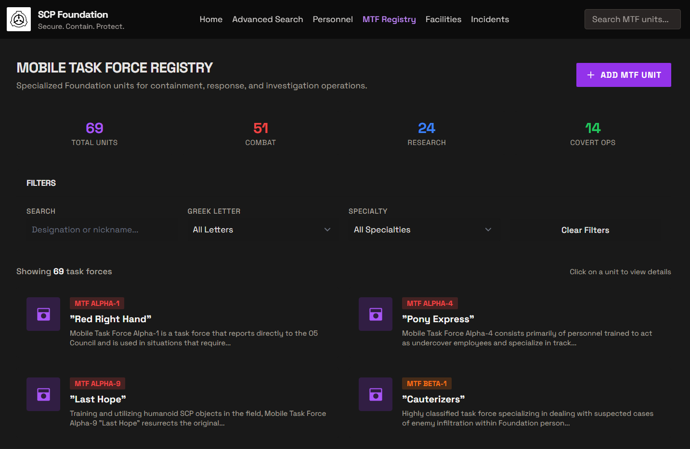

### MTF Designation Format

MTF designations follow a Greek letter + number format:
- **Greek Letter** - Indicates the task force series
- **Number** - Identifies the specific unit within that series

Examples:
- **Alpha-1** ("Red Right Hand") - O5 Council protection
- **Epsilon-11** ("Nine-Tailed Fox") - Site security response
- **Tau-5** ("Samsara") - Immortal cyborg operatives

### Creating a New MTF Unit

1. Click **+ Register MTF**
2. Select the Greek letter designation
3. Enter the unit number
4. Provide nickname and primary role
5. Click **Save**

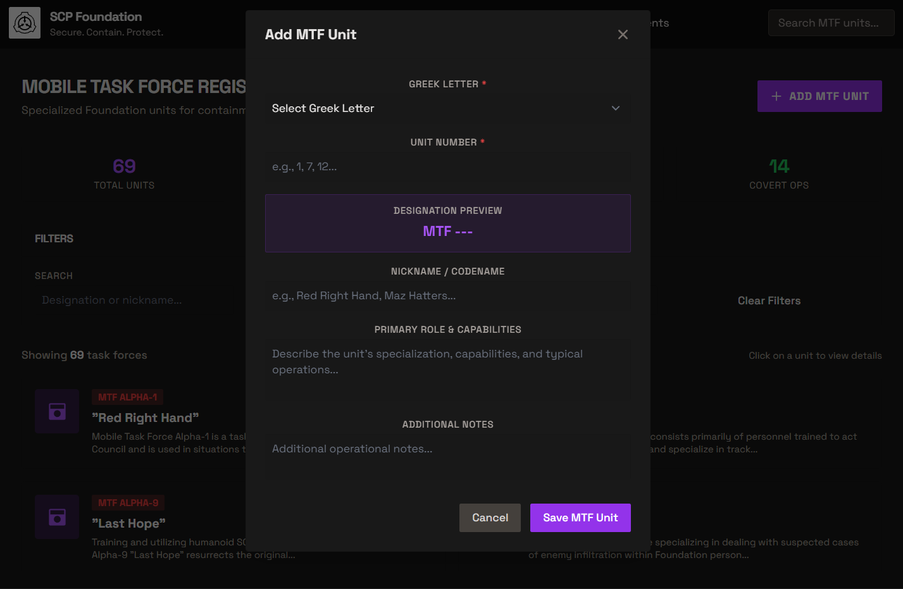

### Disbanding an MTF Unit

1. Open the MTF detail view
2. Click **Disband**
3. Confirm the action

> **Note:** Disbanding an MTF removes all incident associations for that unit.

---

## Facilities Directory

### Types of Facilities

The Foundation operates two main types of facilities:

| Type | Code Format | Purpose |
|------|-------------|---------|
| **Site** | SITE-XX | General containment and research |
| **Area** | AREA-XX | Specialized or large-scale containment |

### Browsing Facilities

The Facilities page shows all Foundation locations:

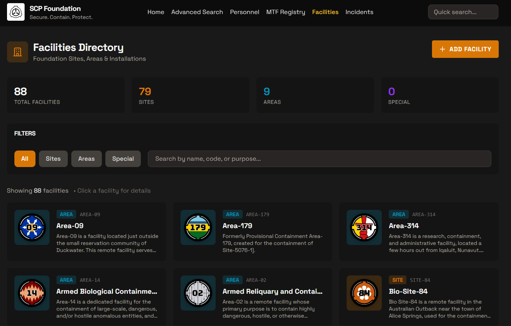

Each facility card displays:
- Facility code and name
- Location (if not classified)
- Primary purpose
- Number of contained SCPs

### Facility Details

Click a facility to view:
- Full address and coordinates
- Containment chambers
- Assigned personnel
- Incident history
- Statistics

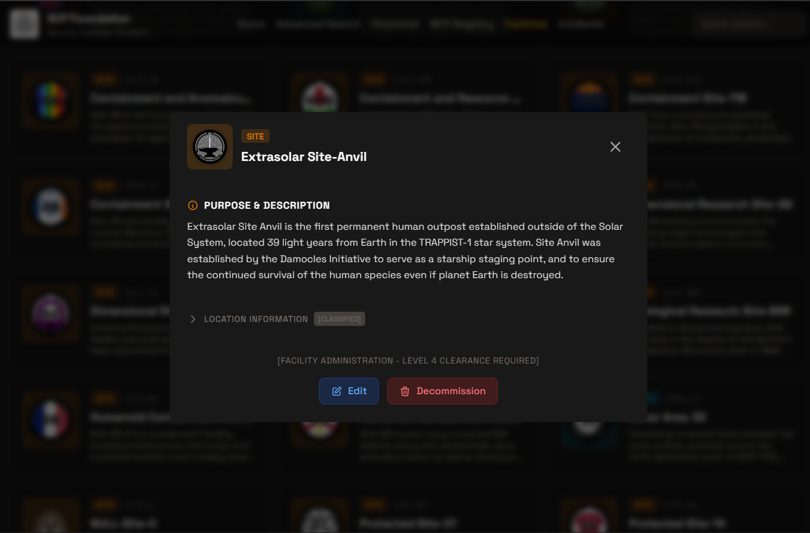

### Adding a New Facility

1. Click **+ Add Facility**
2. Select type (Site or Area)
3. Enter the facility number
4. Fill in location details (optional - can be classified)
5. Describe the facility's purpose
6. Click **Save**

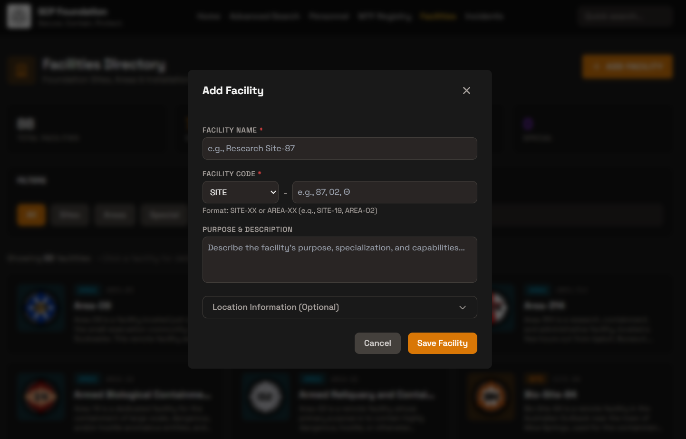

### Decommissioning a Facility

1. Open facility details
2. Click **Decommission**
3. Confirm the action

> **Note:** Decommissioning closes all active personnel and SCP assignments at that facility.

---

## Incident Reports

### Understanding Incident Severity

Incidents are classified using a DEFCON-style severity scale where **lower numbers indicate higher severity**:

| Level | Name | Description | Color |
|-------|------|-------------|-------|
| **1** | Critical | Catastrophic breach requiring immediate response | 🔴 Red |
| **2** | Severe | Major containment failure, significant casualties possible | 🟠 Orange |
| **3** | Elevated | Moderate risk, containment compromised but manageable | 🟡 Yellow |
| **4** | Moderate | Minor breach, situation under control | 🔵 Blue |
| **5** | Low | Minimal impact, routine incident | 🟢 Green |

### Browsing Incidents

The Incidents page displays all recorded events:

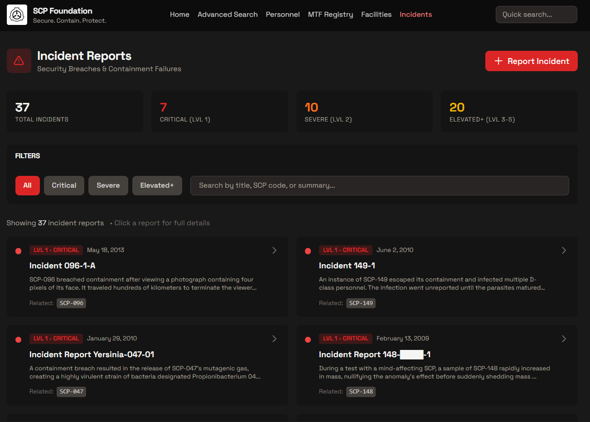

### Filtering Incidents

Use the filter buttons to view incidents by severity:
- **All** - Show all incidents
- **Critical** - Level 1 only
- **Severe** - Level 2 only
- **Elevated+** - Levels 3-5

You can also search by title, summary, or related SCP code.

### Viewing Incident Details

Click an incident card to see:
- Full incident summary
- Date and location
- Related SCPs
- Involved personnel and MTF units

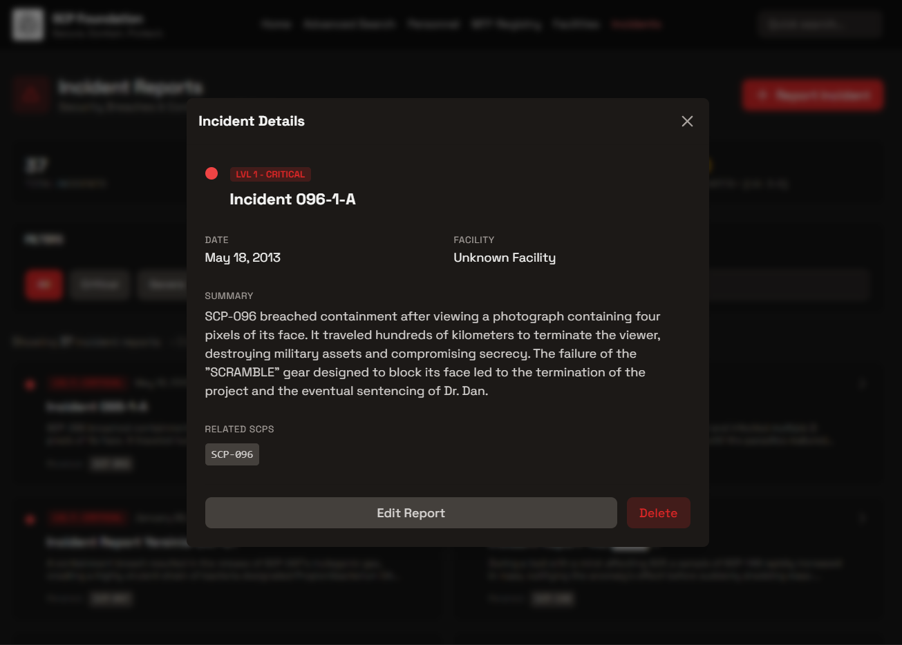

### Reporting a New Incident

1. Click **Report Incident**
2. Select the facility where the incident occurred
3. Enter a descriptive title
4. Set the incident date
5. Select the severity level (1-5)
6. Write a detailed summary
7. Link related SCPs using the search field
8. Click **Save Report**

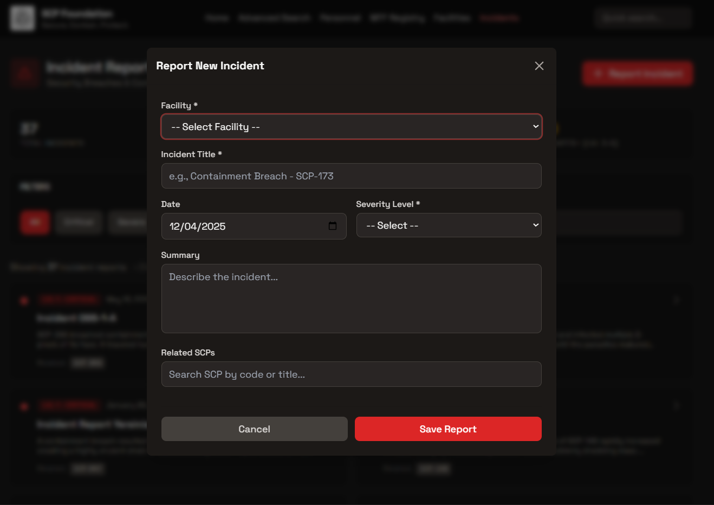

### Linking SCPs to Incidents

When creating or editing an incident:
1. Type an SCP code or title in the search field
2. The SCP will appear as a badge below the search
3. Click the X on a badge to remove a linked SCP

---

## Understanding Object Classes

Object Classes indicate how difficult an SCP is to contain:

### Standard Classes

| Class | Containment Difficulty | Description |
|-------|----------------------|-------------|
| **Safe** | Easy | Reliably contained; low risk if protocols followed |
| **Euclid** | Moderate | Requires significant resources; behavior not fully understood |
| **Keter** | Difficult | Extremely difficult to contain; high risk of breach |
| **Neutralized** | N/A | No longer anomalous or destroyed |
| **Explained** | N/A | Understood through conventional science |

### Esoteric Classes

Some SCPs have special classifications:

| Class | Meaning |
|-------|---------|
| **Thaumiel** | Used by the Foundation to contain other SCPs |
| **Apollyon** | Cannot be contained; may cause end-of-world scenario |
| **Archon** | Should not be contained for various reasons |

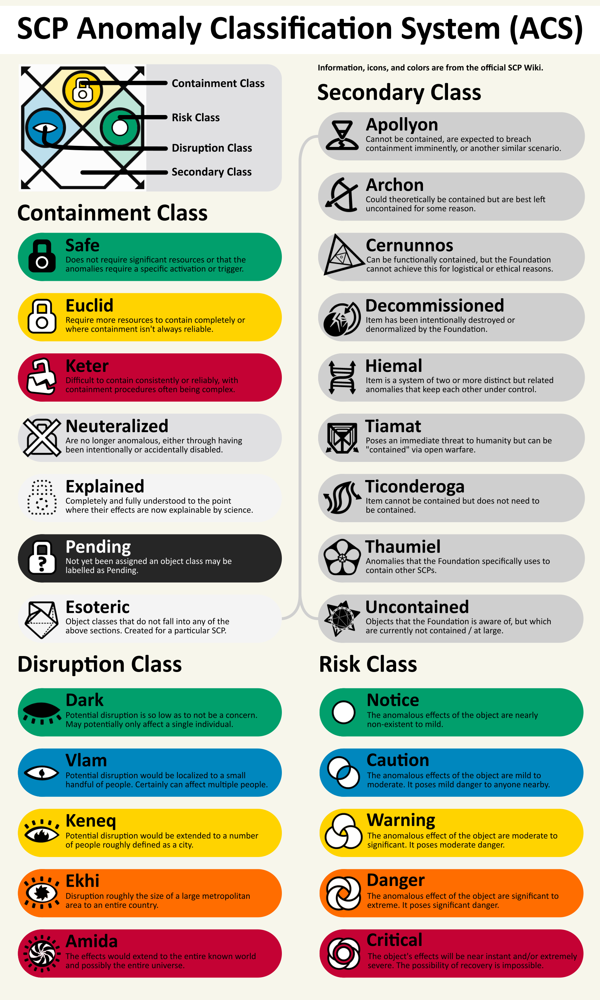

---

## Security Clearance Levels

Access to information is restricted based on clearance level:

| Level | Name | Access |
|-------|------|--------|
| **0** | Official Use Only | Basic Foundation knowledge |
| **1** | Confidential | Safe-class SCPs, general operations |
| **2** | Restricted | Euclid-class SCPs, standard research |
| **3** | Secret | Keter-class SCPs, sensitive operations |
| **4** | Top Secret | Critical information, site administration |
| **5** | Thaumiel | O5 Council, unrestricted access |

> **Note:** In this database system, all information is accessible regardless of your assigned clearance level. Clearance levels are displayed for reference and roleplay purposes.

---

## Glossary

| Term | Definition |
|------|------------|
| **Anomaly** | Any object, entity, or phenomenon that defies scientific explanation |
| **Breach** | When an SCP escapes or breaks containment |
| **Containment** | The procedures and facilities used to secure an SCP |
| **D-Class** | Disposable personnel used for testing dangerous SCPs |
| **Foundation** | The SCP Foundation organization |
| **MTF** | Mobile Task Force - specialized response units |
| **O5 Council** | The 13-member ruling council of the Foundation |
| **Procedure** | Specific instructions for handling an SCP |
| **Researcher** | Personnel who study and document SCPs |
| **Site** | A standard Foundation facility |
| **Area** | A specialized Foundation facility, often for large SCPs |

---

## Tips and Best Practices

### Do's ✓
- Always review containment procedures before interacting with SCPs
- Report incidents promptly with accurate severity ratings
- Use the search function to find information quickly
- Keep personnel records up to date

### Don'ts ✗
- Don't delete records without proper authorization
- Don't underestimate incident severity levels
- Don't leave the application open on shared computers
- Don't share database access credentials

---

## Getting Help

If you encounter issues with the system:

1. **Check this manual** for guidance on common tasks
2. **Refresh the page** if data doesn't load correctly
3. **Clear browser cache** if the interface appears broken

---

## Quick Reference Card

### Keyboard Shortcuts

| Shortcut | Action |
|----------|--------|
| `Enter` (in search) | Execute search |
| `Escape` | Close modal dialogs |

### Common Tasks

| Task | Steps |
|------|-------|
| Find an SCP | Quick search → Type code → Enter |
| Add personnel | Personnel → + Add Personnel → Fill form → Save |
| Report incident | Incidents → Report Incident → Fill form → Save |
| View facility stats | Facilities → Click facility → View statistics |

---